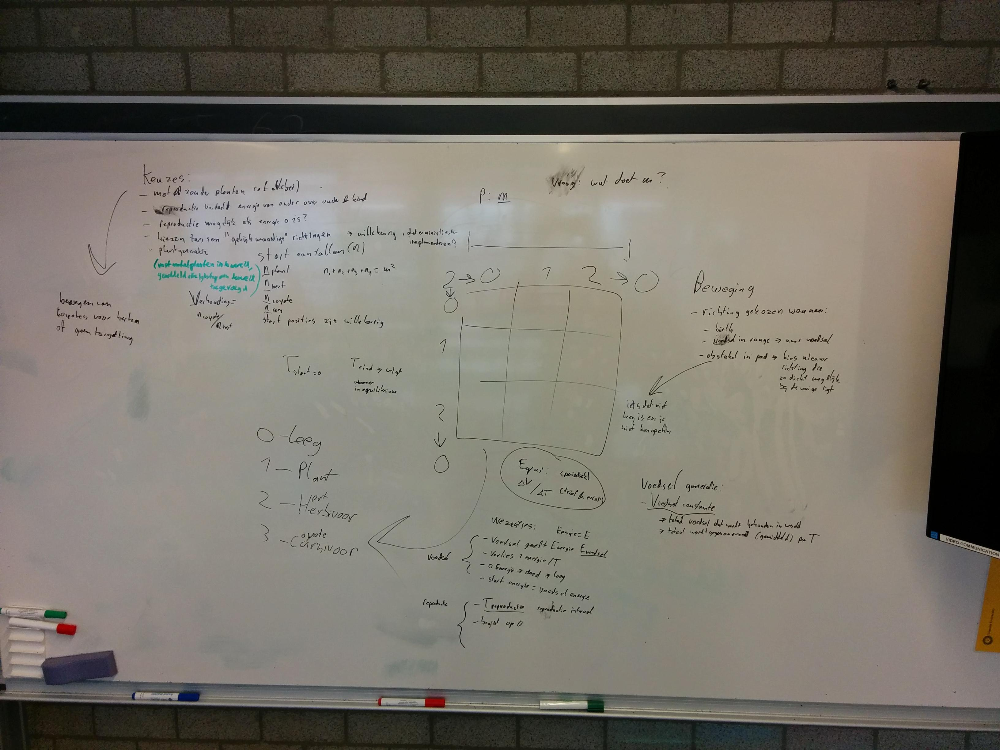
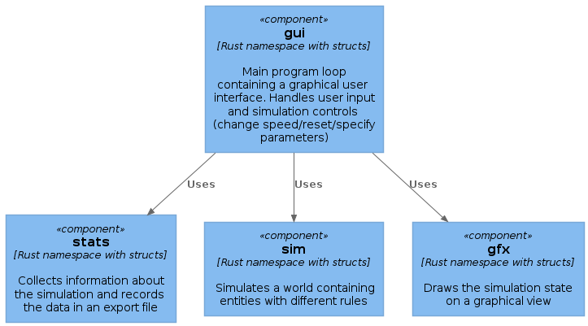

# uu-onderzoeksmethoden

Source code and appendices for the course Onderzoeksmethoden voor de Informatica (B3OMI) at the UU

# Problem definition

# Requirements

The goal of this program is to do the following:

- Provide a platform for building and simulating a grid-based model of cells.
- Collect statistics from the simulated model in order to discover useful results.

By splitting these goals up into requirements, the following list can be formed:

Must:

- Provide a platform for building and simulating a grid-based model
- Allow the user to specify model parameters at the beginning of the simulation
- Show the current state of the model in a graphical user interface
- Allow the user to control the time aspect of the model at runtime (play/pause/speed)
- Collect and write model statistics to a file (including #cells per cell type)

# Building and running

Install the following dependencies:

- Rust compiler and `cargo` (https://www.rust-lang.org/)
- A C toolchain (e.g. MSVC or MinGW on Windows, `build-essential` on Ubuntu)
- SDL2 (https://github.com/Rust-SDL2/rust-sdl2#windows-mingw)

To build and run the program, run the following command at the project root:  
`cargo run`

# Design

The goal of the course is to find a problem that can be expressed in relatively
simple terms, use a model to simulate the problem, and be able to say something
interesting about its results.

Because the exact problem definition is not fixed yet, the main goal of the
design is to provide a platform with which to experiment and compare different
solutions.
