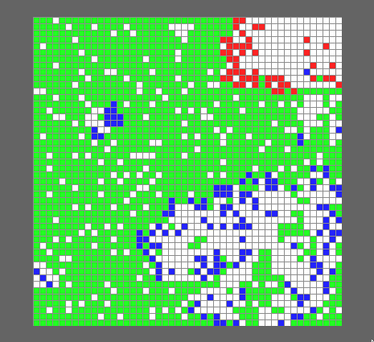
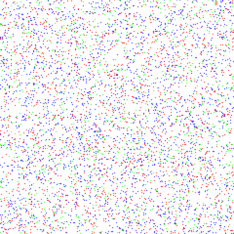

# 2d-predator-prey-model

A cellular automata-based model that simulates the interactions between species
in a food web, based on two models described in Dirk J. Human's 2014 paper
"Modelling predator-prey interactions with cellular automata".

Authored by Casper Uiterwijk and Martijn Drenth.



# Building

This program is written in Rust, and uses the following external dependencies:

- A C toolchain
- The SDL2 cross-platform development library

To install the Rust toolchain and dependencies:

Ubuntu: `sudo apt install cargo build-essential libsdl2-dev`  
NixOS: `nix-shell -p cargo SDL2`  
Windows:

- Rust: https://www.rust-lang.org/
- C toolchain: https://sourceforge.net/projects/mingw/ or https://visualstudio.microsoft.com/downloads/ (MSVC)
- SDL2: https://github.com/Rust-SDL2/rust-sdl2#windows-mingw

# Usage

Running the program can be done by executing the following command at the project root:  
`cargo run --release`

It is possible to specify a few additional arguments by running:

`cargo run --release -- [config file] [stats file]`

```
[config file] (optional) - Path to the config file that specifies the model parameters (default: sample-configs/simple-fish.json)
[stats file] (optional) - If provided, path to write population statistics in CSV format.
```

Controls such as zooming in/out and pausing/resuming are explained in the program's standard output.

# Configuration

Model parameters can be configured via a JSON config file. This file describes which species exist and the predator-prey relationships between species.  
For an example config file, see the `sample-configs/` directory.

# Videos

  
_Simple model with three species (one herbivore, one eating the herbivore, one eating both)_

  
_PPPE model with three species (same as above)_

# References

Human, D. J. (2014). _Modelling predator-prey interactions with cellular automata_. From <http://www.vuuren.co.za/Theses/Project2.pdf>

# Feedback

If you have any ideas on how this model could be improved, feel free to create an issue or contact me by e-mail (see my Github profile).
